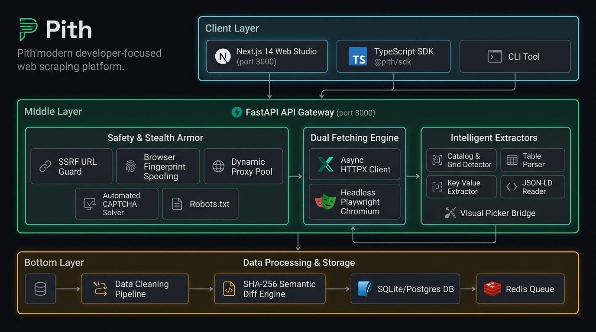
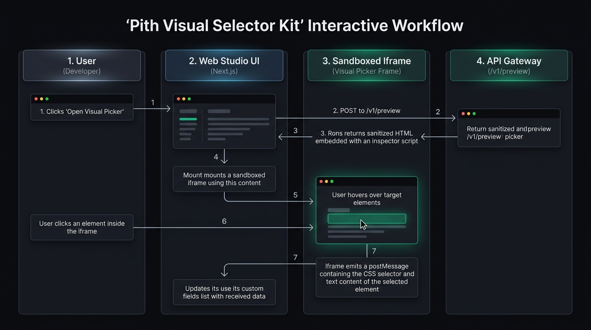

# pith — Intelligent Web Scraping & Detection System

A developer-grade web scraping platform with a Next.js UI, FastAPI Python engine, and TypeScript SDK/CLI. Obeying ethical robots.txt policies, autonomous DOM pattern discovery, visual sandbox inspector, scheduled recipes, change alert diffing, full-site crawling, stealth fingerprinting, and dynamic proxy pools.

```
                  ┌─────────────────────────────────────────────────────────────┐
                  │ [pith] Intelligent Web Scraping System                      │
                  │                                                             │
                  │ 1. URL Safety Check  → SSRF Guard, Robots.txt, Bot Walls    │
                  │ 2. Scrapability Score → 0-100 Gauge & Method Selection      │
                  │ 3. Pattern Detection  → Sibling Card Clustering & Tables    │
                  │ 4. Visual Inspector   → Sandboxed Iframe Hover/Click        │
                  │ 5. Full-Site Crawler  → Sitemaps, BFS Spiders, Clusters     │
                  │ 6. Stealth & Proxies  → Fingerprint Spoofing & Rotation     │
                  │ 7. Extraction Engine  → Pagination, Deduplication, Clean    │
                  │ 8. Recipe Automation  → Hourly/Daily/Weekly Schedules       │
                  │ 9. Change Alerts      → Row Hashing, Field Diffs & Alerts   │
                  │ 10. Public REST Feeds → GET /v1/r/{slug}/data               │
                  └─────────────────────────────────────────────────────────────┘
```

---

## System Architecture




---

## Core Modules & Code Map

| Component | Path | Description |
| :--- | :--- | :--- |
| **API Endpoints** | [`apps/api/app/api/v1/`](file:///d:/Projects/pith-webscrapping/apps/api/app/api/v1) | REST endpoints for health, inspection, detection, preview, recipes, jobs, sites, and proxies. |
| **Fetcher Engine** | [`apps/api/app/services/engine/fetcher.py`](file:///d:/Projects/pith-webscrapping/apps/api/app/services/engine/fetcher.py) | Dual-engine fetching (HTTPX + Playwright) with gzip/deflate/brotli decoding and retry policies. |
| **Stealth & Evasion** | [`apps/api/app/services/safety/stealth.py`](file:///d:/Projects/pith-webscrapping/apps/api/app/services/safety/stealth.py) | Realistic Client Hints, WebGL vendor/renderer spoofing, `navigator.webdriver` concealment, and WebRTC leak prevention. |
| **Proxy Pool Manager** | [`apps/api/app/services/safety/proxy_manager.py`](file:///d:/Projects/pith-webscrapping/apps/api/app/services/safety/proxy_manager.py) | Multi-strategy proxy rotation (`round-robin`, `least-failed`, `sticky-domain`, `random`) with automatic cooldowns on 429/403. |
| **CAPTCHA Solver** | [`apps/api/app/services/safety/captcha_solver.py`](file:///d:/Projects/pith-webscrapping/apps/api/app/services/safety/captcha_solver.py) | Cloudflare Turnstile, reCAPTCHA v2/v3, and hCaptcha detection with 2Captcha/CapMonster API solving hooks. |
| **SSRF Firewall** | [`apps/api/app/services/safety/url_guard.py`](file:///d:/Projects/pith-webscrapping/apps/api/app/services/safety/url_guard.py) | DNS pre-resolution blocking `127.0.0.1`, RFC1918 private subnets, link-local, and cloud metadata (`169.254.169.254`). |
| **Visual Picker Bridge** | [`apps/api/app/services/detector/html_preview.py`](file:///d:/Projects/pith-webscrapping/apps/api/app/services/detector/html_preview.py) | Sandboxed HTML generator injecting `<base href>` and two-way postMessage inspector scripts. |
| **Site Crawler** | [`apps/api/app/services/site/`](file:///d:/Projects/pith-webscrapping/apps/api/app/services/site) | Multi-page link discovery, sitemap.xml index traversal, and URL pattern clustering. |
| **Web Studio** | [`apps/web/src/app/`](file:///d:/Projects/pith-webscrapping/apps/web/src/app) | Modern Next.js 14 UI with Studio workspace, visual picker modal, jobs tracker, diff inspector, and settings. |

---

## End-to-End System Workflows

### 1. Single Target Auto-Discovery & Extraction

1. **Target Inspection**:
   - The user inputs a URL (e.g., `https://example.com/shop`).
   - The backend runs `validate_url()` to protect against SSRF and tests `robots.txt` compliance.
   - Pith calculates a **Scrapeability Score** (0–100) estimating bot resistance, Cloudflare protection, and JS rendering requirements.

2. **Structure & Pattern Discovery**:
   - The extraction engine detects repeated repeating item patterns (product cards, article lists, search results), HTML tables, key-value entity pairs, and embedded JSON-LD schemas.
   - Discovered structures are presented as selectable category cards with live sample rows.

3. **Data Cleaning & Export**:
   - The user selects desired columns (e.g., `title`, `price`, `image_url`, `rating`).
   - Pith cleans whitespace, normalizes currencies (`$1,299.00` → `1299.00`), and formats dates into ISO-8601.
   - Instant export is available in **JSON**, **CSV**, **Excel**, or **JSONL**.

---

### 2. Visual Selector Kit (Point-and-Click Inspector)

When automated heuristic detection needs custom refinement:




---

### 3. Full-Site Discovery & Multi-Page Crawler

1. **Seed & Discovery**:
   - Input seed domain (e.g., `https://news.ycombinator.com`).
   - Traverses `sitemap.xml` and `sitemap_index.xml` alongside concurrent breadth-first link crawling.
   - Enforces strict domain boundaries to prevent spidering off-domain external links.

2. **Pattern Clustering**:
   - Identifies URL path patterns (e.g., `/item?id=*` vs `/user?id=*`).
   - Extracts sample pages from each cluster for recipe matching.

3. **Batch Extraction & Export**:
   - Concurrently processes queued URLs using worker pools with rate-limiting and domain-level proxy stickiness.
   - Aggregates multi-page datasets into a single downloadable archive.

---

### 4. Stealth & Proxy Pool Management

1. **Browser Fingerprint Spoofing**:
   - Generates randomized, genuine Chromium/macOS/Windows fingerprints (Platform, Sec-Ch-Ua, WebGL ANGLE renderer strings, Hardware Concurrency, AudioContext).
   - Playwright context injects evasion scripts before any document script executes, masking `navigator.webdriver` and spoofing `window.chrome`.

2. **Proxy Rotation & Failover**:
   - Configure proxy endpoints (`http://`, `https://`, `socks5://`).
   - Supports 4 rotation policies:
     - `round-robin`: Cycles sequentially across the pool.
     - `least-failed`: Selects proxies with the highest success rate.
     - `sticky-domain`: Binds a proxy to a target domain to maintain session cookies.
     - `random`: Random selection per request.
   - Triggers exponential cooldowns on HTTP 429 (Too Many Requests) or 403 (Forbidden).

3. **Automated CAPTCHA Solving**:
   - Detects Cloudflare Turnstile, Google reCAPTCHA v2/v3, and hCaptcha tokens.
   - Dispatches background solving tasks via 2Captcha or CapMonster and injects clearance tokens directly into the browser page.

---

### 5. Jobs, Scheduling & Semantic Diff Monitoring

1. **Recipe Creation**:
   - Save extraction configurations (target URL, engine type, CSS/XPath selectors, headers, and cleaning rules).

2. **Scheduled Executions & Webhooks**:
   - Run jobs on a cron schedule or on-demand via the REST API.

3. **Change Detection Engine**:
   - Compares SHA-256 payload hashes against historical snapshots.
   - Calculates semantic diffs (added rows, deleted items, modified price/inventory fields) and triggers instant alert toasts or webhook dispatches.

---

## API Reference Summary

| Method | Endpoint | Description |
| :--- | :--- | :--- |
| `POST` | `/v1/check` | Analyze target URL scrapeability score, bot defenses, and robots.txt. |
| `POST` | `/v1/detect` | Auto-detect catalogs, tables, entities, and JSON-LD schemas from HTML. |
| `POST` | `/v1/preview` | Generate a sanitized HTML preview for the Visual Selector Kit. |
| `GET` | `/v1/preview/render` | Direct HTML render endpoint for iframe embedding. |
| `GET` / `POST` | `/v1/recipes` | List or create reusable extraction recipes. |
| `POST` | `/v1/recipes/{id}/run` | Execute a saved recipe and return structured dataset. |
| `POST` | `/v1/sites/discover` | Discover site-wide link graphs, sitemaps, and URL clusters. |
| `POST` | `/v1/sites/crawl` | Run multi-page batch extraction over discovered URL patterns. |
| `GET` / `POST` | `/v1/proxies` | Retrieve proxy pool health status or add new proxy nodes. |
| `POST` | `/v1/proxies/test` | Live ping and latency test for a proxy node. |

---

## Quickstart & Local Development

### 1. Run Everything with Docker

```bash
docker compose up --build
```
- **Web Studio**: [http://localhost:3000](http://localhost:3000)
- **API & Docs**: [http://localhost:8000/docs](http://localhost:8000/docs)

---

### 2. Local Development

#### API Backend (Python 3.12+)
```bash
python -m pip install -r apps/api/requirements.txt
uvicorn app.main:app --reload --port 8000 --app-dir apps/api
```

#### Run Backend Test Suite (43 Tests)
```bash
pytest apps/api/tests -v
```

#### Web Frontend (Next.js)
```bash
npm install
npm run dev --workspace=apps/web
```

---

## TypeScript SDK Usage

```typescript
import { PithClient } from '@pith/sdk';

const pith = new PithClient({ baseUrl: 'http://localhost:8000' });

async function main() {
  // 1. Inspect URL scrapability & bot defense
  const check = await pith.checkUrl('https://example.com/products');
  console.log(`Scrape Score: ${check.score}/100, Requires Browser: ${check.requires_browser}`);

  // 2. Auto-detect structures
  const detect = await pith.detectStructures('https://example.com/products');
  console.log(`Discovered ${detect.total_categories} categories`);

  // 3. Run extraction recipe
  const result = await pith.runRecipe('recipe_123', {
    maxPages: 5,
    enableStealth: true,
  });
  console.log(`Extracted ${result.total_rows} items`);
}
```

---

## License
MIT © Pith Systems

