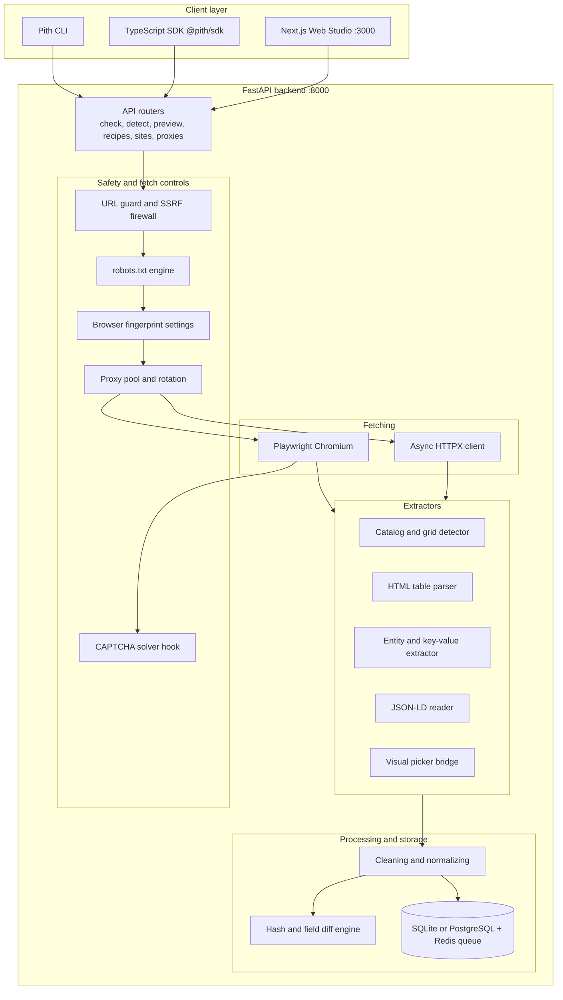
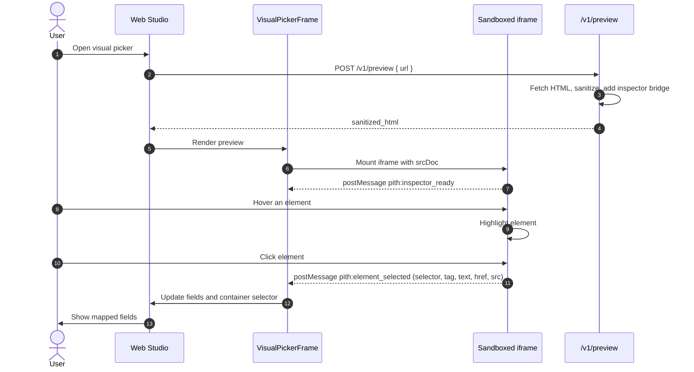

# Pith

Pith is a web scraping and data extraction platform for developers. Give it a URL. It checks if the page can be scraped, finds the data on it, lets you pick what you need, and exports it. It can also map a whole site from one URL.

The core of the page, without the peel.

**Stack:** FastAPI, HTTPX, Playwright, Selectolax, Next.js 14, TypeScript.

---

## Features

- **URL check.** Validates the URL, blocks unsafe targets, reads `robots.txt`, and gives a Scrapeability Score from 0 to 100.
- **Auto-detection.** Finds product cards, article lists, search results, HTML tables, key-value pairs, and JSON-LD. Each one shows up as a category with sample rows.
- **Visual picker.** Click an element on a page preview to add it as a field. Pith builds the selector for you.
- **Site mode.** Enter one URL. Pith reads sitemaps, crawls internal links, groups pages by URL pattern, and extracts from the pages you choose.
- **Data cleaning.** Trims text, normalizes prices and dates, and removes duplicates.
- **Export.** JSON, CSV, Excel, and JSONL.
- **Recipes.** Save a setup, rerun it on demand or on a schedule.
- **Change detection.** Compares each run with the last one. Shows added, removed, and changed rows. Can send webhooks.
- **Dual fetch engine.** Fast HTTPX for static pages. Playwright Chromium for pages that need JavaScript.
- **Proxy pool.** Rotation, health tracking, and cooldowns.
- **TypeScript SDK and CLI.** Use Pith from code or the terminal.
- **Monospace Web Studio.** A clean dev-tool style interface.

---

## Architecture



---

## Code map

| Part | Path | What it does |
| :--- | :--- | :--- |
| API endpoints | `apps/api/app/api/v1/` | REST routes for health, check, detect, preview, recipes, jobs, sites, and proxies. |
| Fetcher | `apps/api/app/services/engine/fetcher.py` | HTTPX and Playwright fetching. Handles gzip, deflate, brotli, and retries. |
| Stealth | `apps/api/app/services/safety/stealth.py` | Client hints, WebGL spoofing, `navigator.webdriver` handling, WebRTC leak prevention. |
| Proxy manager | `apps/api/app/services/safety/proxy_manager.py` | Proxy rotation with four strategies and cooldowns on 429 and 403. |
| CAPTCHA solver | `apps/api/app/services/safety/captcha_solver.py` | Detects Turnstile, reCAPTCHA v2/v3, and hCaptcha. Hooks for 2Captcha and CapMonster. |
| URL guard | `apps/api/app/services/safety/url_guard.py` | DNS pre-resolution. Blocks localhost, private ranges, link-local, and cloud metadata addresses. |
| Visual picker bridge | `apps/api/app/services/detector/html_preview.py` | Builds a sandboxed preview with a `<base href>` and a two-way `postMessage` inspector. |
| Site crawler | `apps/api/app/services/site/` | Link discovery, sitemap traversal, and URL pattern clustering. |
| Web Studio | `apps/web/src/app/` | Next.js UI: studio, visual picker modal, jobs, diff view, settings. |

---

## Quick start

### Requirements

- Python 3.12
- Node.js 20 or newer
- Redis (for the job queue)

### Install

```bash
# Backend
cd apps/api
pip install -r requirements.txt
playwright install chromium
cd ../..

# Frontend and workspaces
npm install
```

### Run

```bash
# 1. API on port 8000
uvicorn app.main:app --reload --port 8000 --app-dir apps/api

# 2. Web Studio on port 3000
npm run dev --workspace=apps/web
```

Open `http://localhost:3000`.

### Test

```bash
pytest apps/api/tests/ -v
```

The backend has 43 tests.

---

## How it works

### 1. Single page

1. Enter a URL.
2. Pith validates it, checks `robots.txt`, and runs the Scrapeability Score. The score looks at bot protection, Cloudflare, and whether the page needs JavaScript.
3. Pith detects repeated item patterns, tables, key-value pairs, and JSON-LD. Each shows as a card with live sample rows.
4. You pick the columns you want, like `title`, `price`, `image_url`, and `rating`.
5. Pith cleans the data. For example, `$1,299.00` becomes `1299.00`, and dates become ISO 8601.
6. Export as JSON, CSV, Excel, or JSONL.

### 2. Visual picker

Use this when auto-detection needs a fix.



### 3. Site mode

1. Enter a seed URL, like `https://news.ycombinator.com`.
2. Pith reads `sitemap.xml` and `sitemap_index.xml`, and crawls internal links at the same time. It stays on the same domain.
3. Pith groups pages by URL pattern, like `/item?id=*` and `/user?id=*`, and takes sample pages from each group.
4. You choose which groups to extract.
5. Workers process the queued URLs with rate limits and per-domain proxy stickiness.
6. Results are merged into one downloadable archive.

### 4. Proxies, fingerprints, and CAPTCHAs

- **Fingerprints.** Pith builds browser fingerprints (platform, `Sec-Ch-Ua`, WebGL renderer, hardware concurrency, AudioContext). Playwright injects the scripts before any page script runs.
- **Proxy rotation.** Supports `http://`, `https://`, and `socks5://` proxies with four strategies:
  - `round-robin`: go through the pool in order.
  - `least-failed`: pick the proxy with the best success rate.
  - `sticky-domain`: keep one proxy per domain, so cookies stay valid.
  - `random`: pick a random proxy for each request.
- **Cooldowns.** A proxy gets an exponential cooldown after an HTTP 429 or 403.
- **CAPTCHA hook.** Pith detects Turnstile, reCAPTCHA, and hCaptcha. It can send the task to 2Captcha or CapMonster and inject the token back into the page.

### 5. Recipes, schedules, and change detection

1. **Recipes.** Save the target URL, engine, selectors, headers, and cleaning rules.
2. **Schedules.** Run on a cron schedule or call the API.
3. **Diffs.** Pith compares SHA-256 hashes with older snapshots, then lists added rows, removed rows, and changed fields like price or stock. It can show a toast or send a webhook.

---

## API

| Method | Endpoint | Description |
| :--- | :--- | :--- |
| `POST` | `/v1/check` | Scrapeability score, bot defenses, and `robots.txt` result. |
| `POST` | `/v1/detect` | Detect catalogs, tables, entities, and JSON-LD in a page. |
| `POST` | `/v1/preview` | Sanitized HTML preview for the visual picker. |
| `GET` | `/v1/preview/render` | HTML render endpoint for iframe embedding. |
| `GET` `POST` | `/v1/recipes` | List or create recipes. |
| `POST` | `/v1/recipes/{id}/run` | Run a saved recipe and return the dataset. |
| `POST` | `/v1/sites/discover` | Discover link graphs, sitemaps, and URL clusters. |
| `POST` | `/v1/sites/crawl` | Run batch extraction over chosen URL patterns. |
| `GET` `POST` | `/v1/proxies` | Get proxy pool health or add a proxy. |
| `POST` | `/v1/proxies/test` | Test the latency of a proxy. |

---

## SDK

```typescript
import { PithClient } from '@pith/sdk';

const pith = new PithClient({ baseUrl: 'http://127.0.0.1:8000' });

async function main() {
  // 1. Check the URL
  const check = await pith.checkUrl('https://example.com/products');
  console.log(`Score: ${check.score}/100, needs browser: ${check.requires_browser}`);

  // 2. Detect structures
  const detect = await pith.detectStructures('https://example.com/products');
  console.log(`Found ${detect.total_categories} categories`);

  // 3. Run a recipe
  const result = await pith.runRecipe('recipe_123', {
    maxPages: 5,
    enableStealth: true,
  });
  console.log(`Extracted ${result.total_rows} items`);
}

main();
```

---

## Responsible use

Pith has safety checks on by design. It blocks private network targets (SSRF protection) and reads `robots.txt` before it fetches.

The fingerprint, proxy, and CAPTCHA features are advanced tools. Use them only on sites you own, or where you have permission to scrape. Bypassing a site's bot protection can break its terms of service and, in some places, the law. You are responsible for how you use Pith.

Good habits:

- Keep rate limits low.
- Respect `robots.txt` and crawl delays.
- Do not collect personal data without a legal reason.
- Check the site's terms before a large crawl.

---

## License

Add your license here.